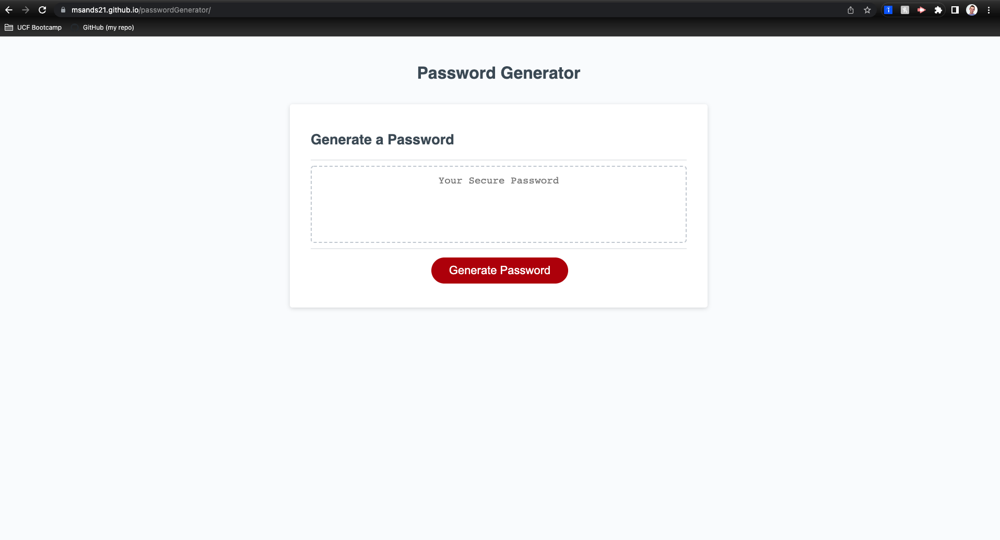

# passwordGenerator
JavaScript Homework assignment for UCF Bootcamp 3/31/22

**Project Decscription**
In this project, I built a password generator using strictly JavaScript. The HTML and CSS were provided while the goal here was to make sure the user is prompted with password length and character questions regarding the random password being requested by clicking on the generate password button. After all of the prompts are correctly answered, the user will be gifted a random password based on the entered criteria and it appears in the text-box given. Three main functions were used to acquire information via prompts/confirms, concat user input into selected arrays. This would signal the next function to begin writing the password which would signal the generate password function to appropiately create the length and acquire random characters given the user answers. A simple for loop was used to help generate the password as well as math.floor(math.random)*[]length to acquire the random character. This information is returned back to the write password function to be displayed in the given textbox. 

## Project Location
Repo Link: [RepoLink] https://github.com/Msands21/passwordGenerator

Live Link: [LiveLink] https://msands21.github.io/passwordGenerator/

### Contact Info
mikesands94@gmail.com

#### Project Example

